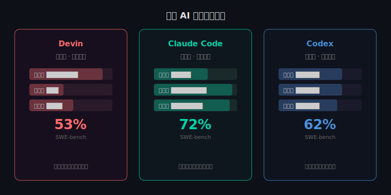
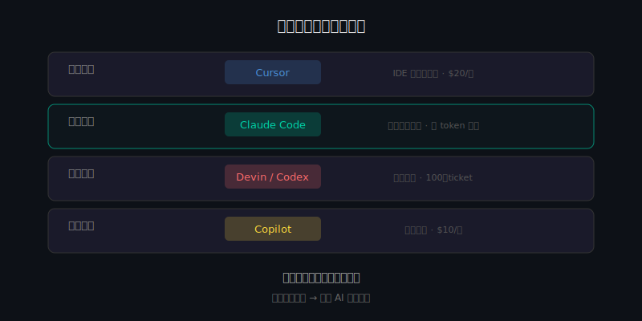

2026 年，AI 编程工具的竞争进入了白热化。

三个产品几乎同时抢占了"AI 码农"这个定位：Cognition 的 Devin、Anthropic 的 Claude Code、OpenAI 的 Codex。它们都号称能自主完成编码任务——写功能、改 Bug、跑测试、提 PR。

但"能用"和"能交付"之间，差了十万八千里。

我用真实工程场景测了一圈，发现它们的设计哲学完全不同，适合的人群也完全不同。

---

## 三条完全不同的路

先说最核心的区别。这三个工具，走的是三条完全不同的技术路线。

**Devin：全自主，异步交付。** 你给它一个 ticket，它自己开环境、写代码、跑测试、提 PR。你不用盯着它，过几个小时来收结果就行。它的目标是"替代初级开发者"。

**Claude Code：同步协作，人在回路。** 它在你的终端里运行，理解整个代码库的架构。你说"重构这个模块"，它会先跟你确认方案，再动手改。它的目标是"给高级开发者配一个懂架构的搭档"。

**Codex：云端沙盒，安全优先。** 它把你的代码克隆到一个隔离的云端容器里操作，改完之后你来 review。它的目标是"在安全可控的前提下自动化"。

一个是放手让它干，一个是肩并肩一起干，一个是在隔离间里让它干。

---

## 四个工程维度对比

跑分没用，SWE-bench 的分数只能说明"理论能力"。真正的问题是：在你的日常工程场景里，谁更靠谱？

### 1. 自主性 vs 可控性

Devin 的自主性最高。你可以把一个 Jira ticket 丢给它，下班回来看结果。这在处理大量重复性任务时非常有用——比如批量修复 lint 错误、升级依赖版本、写单元测试。

但自主性的代价是可控性。Devin 犯错时你不在场，等到发现问题，它可能已经沿着错误方向写了几百行代码。

Claude Code 走了另一个极端：每步都跟你确认。要删文件？先问你。要改架构？先跟你讨论方案。这在做复杂重构时是优势——你不会被一个错误的架构决策带跑。但代价是你必须全程在场。

Codex 介于两者之间。它在云端沙盒里自主执行，但改动必须经过你的 review 才能合并。安全，但多了一步手动检查的环节。

### 2. 单文件 vs 跨文件理解

这是区分"玩具"和"工具"的关键维度。

Claude Code 在跨文件理解上目前领先。得益于最高 100 万 token 的上下文窗口，它能同时理解多个文件的依赖关系，在重构时保持一致性。SWE-bench 上 72% 的通过率，主要靠的就是这个能力。

Devin 在单文件任务上表现不错，但在涉及多个模块联动的场景中容易出问题。它的思维链更擅长"线性推进"，不太擅长"全局把控"。

Codex 最新版本（基于 GPT-5.3）的跨文件能力提升明显，但受限于云端沙盒的架构，它对本地环境的状态感知不如直接在你机器上跑的 Claude Code。

### 3. 本地环境 vs 云端沙盒

这个选择影响的不只是技术架构，还有安全策略。

Claude Code 直接在你的本地终端运行，能访问你的全部开发环境——数据库、配置文件、环境变量。优势是：它看到的和你看到的完全一样，不存在"环境不一致"的问题。风险是：它有权限动你的真实环境。

Codex 跑在隔离容器里。每次任务都是一个干净的克隆环境。好处是安全——它不会误删你的数据库。坏处是它可能缺少本地特有的配置，导致测试通过了但实际部署有问题。

Devin 也用独立环境，但它的环境管理更自动化——能自己装依赖、配环境变量。这在标准化项目中很方便，但遇到复杂的本地依赖（比如需要连内网数据库）就可能卡住。

### 4. 成本效益比

这是个现实问题。

Copilot（GitHub 的自动补全）每月 $10，是最便宜的入门选择。但它不是 Agent，只是补全。

Claude Code 按 token 计费，重度使用时一天可能花 $20-50。做一次大型重构可能烧掉 $100。但如果这次重构人工要做三天，算下来还是值的。

Codex 的定价在 $20/月的基础上加 token 消耗，比较均衡。

Devin 的团队版定价更高，适合有大量标准化任务的团队。

**关键不是谁更便宜，而是谁在你的场景里 ROI 最高。**

---

## 实测数据

SWE-bench verified（自动化软件工程任务基准测试）的最新数据：

| 工具 | 通过率 | 强项 |
|------|--------|------|
| Claude Code (Opus 4.6) | 72%+ | 跨文件重构、复杂架构 |
| Codex (GPT-5.3) | 60-65% | 标准化任务、模块开发 |
| Devin | 53% | 异步批量任务 |

但这些数字有个重要的前提条件：**它们测的是标准化的开源项目任务。** 你的真实项目——有历史债务、有奇怪的架构决策、有只有你知道的潜规则——通过率会低很多。

---

## 不是选一个，而是组合

我观察到一个趋势：效率最高的开发者，不是只用一个工具。

他们的工具栈通常是：

- **日常编码**：Cursor（IDE 内快速编辑）
- **复杂重构**：Claude Code（理解全局架构）
- **批量任务**：Devin 或 Codex（异步处理）
- **代码补全**：Copilot（随手就用）

就像木匠不会只用一把锤子。不同的工程任务，需要不同类型的 AI 协作模式。

---

## 选择建议

**如果你是独立开发者 / 小团队：** Claude Code。它的"搭档模式"最适合需要深度理解代码库的场景。代价是你需要全程参与。

**如果你的团队有大量标准化任务：** Devin。积压了 100 个小 ticket？让 Devin 异步处理。但你需要一个人来 review 它的产出。

**如果安全合规是首要考虑：** Codex。云端沙盒隔离，代码不会被意外修改。适合金融、医疗等对安全要求高的场景。

**如果预算有限：** Copilot + Cursor 的组合。不是 Agent，但在大多数日常场景中够用了，月成本不到 $30。

---

## 真正的问题不是"哪个更好"

三个 AI 码农的竞争，背后反映的是一个更大的趋势：**软件开发正在从"人写代码"变成"人管理 AI 写代码"。**

这三个工具代表了三种管理模式：

- Devin = 委托式管理（"你去做，做完告诉我"）
- Claude Code = 协作式管理（"我们一起做，你听我指挥"）
- Codex = 审核式管理（"你在隔离间做，我来 review"）

哪种模式适合你，取决于你的项目复杂度、你的技能水平、和你对风险的容忍度。

但不管选哪种，有一件事是确定的：**纯粹的"手写代码"能力正在贬值。理解架构、定义问题、验证结果的能力正在升值。**

工具在变，但工程的本质没变。
