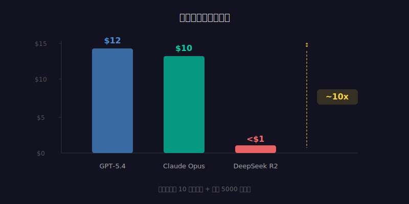
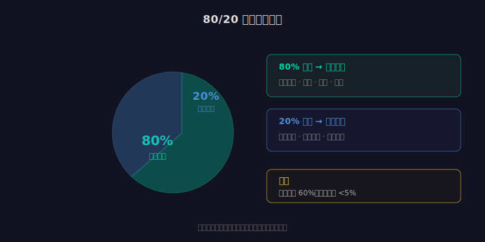

2026 年 4 月，DeepSeek 发布了 R2 模型。

在数学推理和代码生成的基准测试上，它达到了跟 GPT-5.4 和 Claude 同级别的水平。但价格只有它们的几分之一。

这不是第一次有人试图用低价搅局。但这一次，效果是真实的。

---

## 便宜到什么程度

拿一个具体场景算：你用 AI 分析 10 万字的文档，然后生成一份 5000 字的报告。

用 GPT-5.4，大概花 $8-15。用 Claude Opus 4.6，差不多也是这个区间。用 DeepSeek R2，不到 $1。

差了近 10 倍。

如果你是个人开发者，偶尔用一下，这个差距不重要。但如果你是一家公司，每天要处理几千个这样的任务，10 倍的成本差异就是"做不做得起"的问题。

---

## 价格战的三层连锁反应

### 第一层：更多应用变得可行

之前很多 AI 应用方案，做到一半发现"算不过来账"——AI 调用成本太高，用户付费又不够高，中间的差价要公司自己补。

当模型价格降到原来的十分之一，很多之前"不划算"的场景突然变得可行了。

比如：给每个客服消息做实时情感分析、给每篇文章自动生成多语言版本、给每个代码提交做 AI review。这些之前只有大厂才做得起的事，现在小团队也能做了。

### 第二层：竞争焦点转移

当模型本身不再是壁垒，竞争的焦点就从"谁的模型更强"变成"谁能把模型用得更好"。

这意味着：prompt engineering、数据管道、业务逻辑集成、用户体验设计——这些"围绕模型的工程"变得比模型本身更重要。

对开发者来说，这是个好消息：你不需要自己训练模型，也不需要担心被某一家 API 锁定。你只需要擅长把 AI 嵌入到业务流程里。

### 第三层：开发者门槛降低

以前，调 AI API 是有门槛的——不是技术门槛，是财务门槛。一个实验性项目，测试几天就烧了几百美元，很多独立开发者承受不了。

现在，同样的实验可能只花几十美元。这意味着更多人能参与 AI 应用开发，更多创意能被验证，更多长尾场景能被覆盖。

---

## 便宜的代价

但便宜不是没有代价的。

**数据隐私。** DeepSeek 的服务器在中国，数据经过中国的网络基础设施。对于处理敏感商业数据的场景，很多公司的合规部门会直接说不。

**模型透明度。** 相比 OpenAI 和 Anthropic 发布的技术报告，DeepSeek 对模型的训练数据、安全对齐过程的披露更少。你在用一个"好用但不太清楚怎么来的"工具。

**长期可用性。** 创业公司的低价策略能持续多久？如果是靠补贴烧钱抢市场，价格迟早会涨。如果你的整个技术栈绑定在一个低价 API 上，价格变动会直接影响你的商业模型。

**性能边界。** R2 在数学推理上很强，但在复杂的多轮对话、长上下文保持、创意写作等方面，跟 GPT-5.4 和 Claude 仍有差距。便宜的模型不是万能的。

---

## 什么场景该用什么价位的模型

价格战的真正意义不是"所有人都换成最便宜的"，而是让你可以**按场景分配预算**。

| 场景 | 推荐选择 | 原因 |
|------|----------|------|
| 批量数据处理、分类、摘要 | 低价模型（DeepSeek、开源） | 任务简单、量大，成本敏感 |
| 代码生成、Bug 修复 | 中高端模型（Claude Sonnet、GPT-5.1） | 准确性要求高，但不需要顶级 |
| 复杂架构设计、关键决策 | 顶级模型（Claude Opus、GPT-5.4） | 错一步成本极高，不能省 |
| 个人学习、实验 | 低价模型或免费 tier | 不涉及生产环境，怎么便宜怎么来 |

聪明的做法是：**让 80% 的调用走低价模型，20% 的关键调用用顶级模型。** 这样总成本可能降低 60%，而质量下降不到 5%。

---

## 对开发者意味着什么

模型成本正在快速下降，这个趋势不会停。

这意味着三件事：

**第一，"用得起好模型"不再是竞争优势。** 当所有人都能以低成本调用强大的 AI，差异化只能来自"怎么用"而不是"用不用"。

**第二，"围绕模型的工程"价值在上升。** 数据管道、评估体系、安全防护、业务集成——这些不会随着模型降价而贬值。相反，当更多人涌入 AI 应用开发，做好这些工程的能力反而更稀缺。

**第三，多模型策略成为标配。** 不再是"选一个 API 用到底"，而是根据任务类型、成本要求、延迟需求、合规限制，动态路由到不同的模型。这种"模型编排"能力本身就是一项工程技能。

DeepSeek R2 打下来的不只是价格，还有"只用一个模型"的旧思维。
