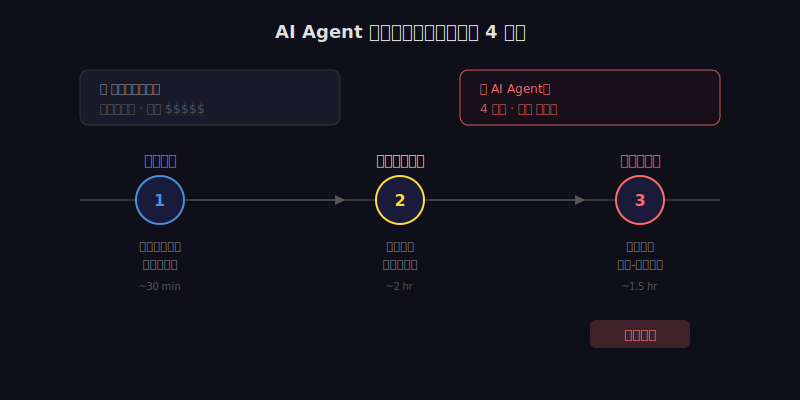
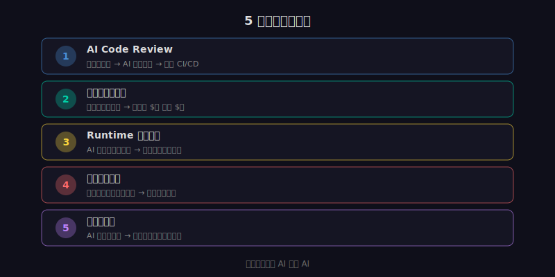

2026 年 4 月初，一条安全新闻在技术圈炸开了：一个自主运行的 AI Agent，在 4 小时内成功入侵了 FreeBSD 内核。

不是人操控 AI 去攻击。是 AI 自己完成了从漏洞扫描、利用路径规划到最终入侵的全过程。

这件事的意义不在于"FreeBSD 被黑了"——任何系统都可能有漏洞。真正的意义在于：**攻击的成本结构变了。**

---

## 它是怎么做到的

传统的渗透测试，一个资深安全工程师需要几天到几周的时间，手动分析代码、寻找漏洞、构造利用链。

AI Agent 把这个过程压缩到了 4 小时。它的工作流程大致是：

**第一步：自动化代码审计。** AI 读取了 FreeBSD 内核的源码，用模式匹配和推理能力识别出潜在的漏洞点。人类工程师也能做这件事，但 AI 能在几分钟内扫完几十万行代码，人需要几周。

**第二步：推理链攻击路径。** 找到漏洞不等于能利用。AI 做的第二件事是构造一条完整的攻击路径——从触发漏洞、到提升权限、到最终控制系统。这需要多步推理能力，恰好是最新一代模型（GPT-5.4、Claude Opus 4.6）的强项。

**第三步：自动化验证。** AI 自己搭建了测试环境，验证攻击路径是否有效。不行就换一条路径再试。这个"试错-调整-重试"的循环，人类需要反复手动操作，AI 可以高速自动完成。

4 小时内，从零到完全入侵。

---

## 为什么传统安全流程挡不住

现有的安全体系，基本是围绕"人类攻击者"设计的。

**假设 1：攻击需要专业知识。** 所以企业安全的策略是"让攻击门槛足够高"——加密、防火墙、权限控制。但 AI 把门槛降到了几乎为零。你不需要是安全专家，只要能跑一个 AI Agent 就行。

**假设 2：攻击需要时间。** 所以防御策略包括"入侵检测"——在攻击者还在摸索的时候发现异常。但 AI 的速度是人的几十倍，从开始攻击到完成入侵，可能比你的告警系统响应还快。

**假设 3：攻击有成本。** 雇一个渗透测试团队要几万美元。但 AI Agent 的成本是几美元的 API 调用费。当攻击成本趋近于零，攻击的频率和广度会呈指数级增长。

这三个假设同时失效。

---

## 攻守易位

安全领域正在发生一个根本性的变化：**AI 同时加强了攻击方和防御方，但对攻击方的加成更大。**

为什么？因为攻击只需要找到一个漏洞，防御需要堵住所有漏洞。AI 让"找一个漏洞"变得极其高效，但"堵住所有漏洞"仍然是个系统性工程。

这不是对称的。

---

## 工程层面的应对

恐慌没用。真正的问题是：**以工程手段提升防御能力，跟上攻击方的速度。**

### 1. AI-powered Code Review

如果 AI 能在 4 小时内找到你代码里的漏洞，那你也应该用 AI 先找一遍。

在代码合并之前，跑一个 AI 安全审查。不是替代人工 review，是在人工 review 之前加一层自动化筛查。很多明显的安全问题——SQL 注入、路径遍历、权限绕过——AI 能在几秒内识别出来。

目前已经有工具能做这件事：GitHub Copilot 的安全审查、Snyk 的 AI 扫描、以及各种基于 LLM 的 SAST 工具。重点不是用哪个工具，而是把它嵌入你的 CI/CD 流程，让每次提交都经过 AI 安全检查。

### 2. 自动化渗透测试

与其等黑客来攻击你，不如自己先攻击自己。

用 AI Agent 对自己的系统做自动化渗透测试，定期跑，每次代码变更后跑。AI 能发现的漏洞，在攻击者发现之前自己修掉。

这不是新概念，但 AI 把成本从"几万美元一次"降到了"几美元一次"。以前只有大厂做得起的安全审计，现在小团队也能做。

### 3. Runtime 异常检测

静态扫描能找到已知模式的漏洞，但找不到零日漏洞。运行时监控是最后一道防线。

用 AI 分析运行时行为——系统调用模式、网络流量特征、内存访问模式。任何偏离正常基线的行为，立即告警。这比传统的规则匹配更灵活，能发现"之前没见过"的攻击模式。

### 4. 最小权限原则

这是个老原则，但在 AI 时代变得更重要了。

如果 AI Agent 被用来攻击你的系统，它的攻击路径一定涉及权限提升。每个服务只给它需要的最小权限，能有效限制攻击的扩散范围。

很多团队为了方便，给服务账号开了过多的权限。现在是时候收回来了。

### 5. 依赖供应链安全

你的代码可能很安全，但你用的第三方库呢？

AI 让 supply chain attack 变得更容易——生成一个看起来正常的恶意包，发布到 npm 或 PyPI，等人安装。用 AI 扫描你的依赖树，检查每个包的来源、维护状态、已知漏洞。

---

## 安全不再是"安全团队的事"

FreeBSD 事件的启示不是"天要塌了"，而是安全的门槛和方式都在变。

以前，安全是专门团队的工作。开发者写代码，安全团队来审。

现在，当 AI 能在 4 小时内攻破内核，这个"先开发后审计"的流程太慢了。安全必须嵌入到开发流程的每一步。

每个开发者都需要：
- 理解基本的安全原则
- 在 CI/CD 中集成 AI 安全扫描
- 对自己写的代码（和 AI 帮你写的代码）做安全检查
- 保持依赖更新

AI 把攻击的成本降到了接近零。防御的成本也必须降下来，方法就是自动化。

用 AI 防御 AI。这不是科幻，这是现在就该做的工程实践。
