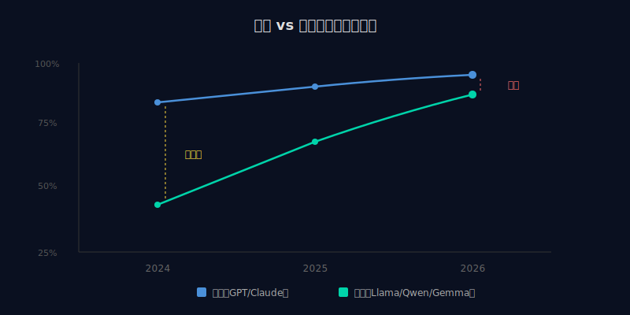
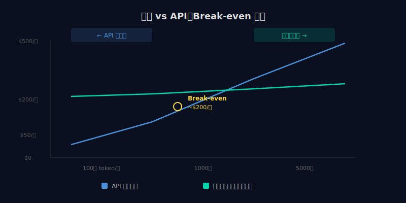

2026 年 4 月，AI 模型市场出现了一个有意思的变化。

Google 开源了 Gemma 4，专门针对端侧部署优化。Meta 更新了 Llama 4 Scout，加入了视觉语言能力。阿里的 Qwen 3.6 Plus 在代码生成上接近 GPT-5 水平。

这不是几个公司发了几个新模型那么简单。真正的变化是：**开源模型在核心能力上，第一次真正接近了商用闭源模型。**

---

## "接近"到底是什么程度

先说数据。

在主流的编码基准测试（HumanEval、SWE-bench）上，Qwen 3.6 Plus 和 Llama 4 的得分已经进入了 GPT-5.1 和 Claude Sonnet 的区间。不是 GPT-5.4 或 Claude Opus 的水平，但已经不是"差两个量级"了。

在推理能力上，DeepSeek R2（虽然不完全开源，但有开放权重版本）在数学和逻辑推理上甚至超过了一些商用模型。

在多语言处理上，Qwen 3.6 对中文的理解明显优于同级别的西方模型。

结论是：**对于 80% 的常见任务——代码补全、文档生成、数据分析、翻译、摘要——开源模型已经够用了。**

剩下的 20%——复杂的多步推理、超长上下文保持、精细的安全对齐、创意性任务——闭源模型仍然有明显优势。

---

## 自建 vs API 调用：break-even 在哪

开源模型最大的吸引力是：你可以自己部署，不用按 token 付费。

但"免费"不等于"零成本"。自建需要：

**硬件。** 跑一个 70B 参数的模型，至少需要一台配 A100 或 H100 的服务器。买的话 $15,000-40,000，租云服务器 $2-8/小时。

**运维。** 模型服务不是部署一次就完事了。需要监控、负载均衡、版本更新、故障恢复。这些都需要人力。

**微调能力。** 开源模型的真正优势是可以针对你的场景微调。但微调需要数据、需要 GPU 算力、需要懂训练的工程师。

算一笔账：

如果你每天的 API 调用成本在 $50 以下（大约 500 万 token/天），用 API 更划算。维护成本低，随用随付。

如果每天 API 调用超过 $200（2000 万+ token/天），自建开始有成本优势。前提是你有运维能力。

如果你有行业特定的数据可以微调，那不管调用量多少，自建都有独特的价值——因为微调后的模型在你的场景里可能比通用商用模型更好。

---

## 真正的差距在哪

虽然基准测试分数接近了，但使用体验上的差距仍然存在。

### 安全对齐

Anthropic 和 OpenAI 在安全对齐上投入了大量资源。它们的模型不会轻易生成有害内容、不会泄露训练数据、在边界场景下有更好的处理方式。

很多开源模型在这方面做得不够。不是说不安全，而是"安全对齐"这件事需要持续投入，开源社区的资源有限。

如果你的应用面向终端用户，安全对齐不是可选项。

### 长上下文

Claude 的 100 万 token 上下文窗口、Gemini 的 200 万 token，这在处理长文档、大型代码库时是巨大的优势。

开源模型的上下文窗口通常在 32K-128K，部分达到了 256K。够用吗？大多数场景够了。但在"分析一整本书"或"理解一个大型代码库"的场景中，差距很明显。

### 多模态

GPT-5.4 原生支持图像、音频、视频理解。Claude 支持图像和文档。

开源多模态模型（Llama 4 Scout、Gemma 4）在图像理解上进步明显，但视频和音频处理仍然是短板。

### 工具调用和 Agent 能力

闭源模型在 function calling、工具使用、多步推理方面做了大量专门优化。这在构建 AI Agent 时非常重要。

开源模型的工具调用能力在提升，但稳定性和准确性仍然不如闭源模型。如果你要构建一个自主执行任务的 Agent，闭源模型目前更可靠。

---

## 开源改变的不只是成本

很多人讨论开源模型时，焦点在"省钱"。但开源真正改变的是权力结构。

**不被锁定。** 如果你的产品完全依赖 OpenAI 的 API，那 OpenAI 涨价、改政策、停服务，你都得承受。开源模型给了你一个退路：最坏情况下，你可以自己跑。

**数据主权。** 用 API 意味着你的数据经过了第三方的服务器。自建意味着数据不出你的机房。对于金融、医疗、政府等领域，这不是偏好，是合规要求。

**定制化。** 商用模型是通用的，它不懂你的行业术语、不了解你的业务逻辑。开源模型可以用你的数据微调，变成一个"懂你的行业"的专用模型。这种差异化是花钱买不到的。

**社区创新。** 开源意味着全球开发者都可以在上面构建。新的训练技术、新的推理优化、新的应用场景——这些创新的速度远超任何单个公司。

---

## 实际建议

**如果你是独立开发者：** 用 API 就好。按需付费，省心省力。把精力放在产品上，不要放在运维上。开源模型可以用来做本地实验和学习。

**如果你是创业团队：** 混合策略。核心功能用商用 API 保证质量，非核心功能用开源模型控制成本。同时评估：你的场景是否有微调的价值？

**如果你是大公司：** 认真考虑自建。数据合规、成本控制、定制化需求——这三个因素加在一起，自建的 ROI 很可能是正的。但需要专门的 ML 运维团队。

**不管什么规模：** 不要把鸡蛋放在一个篮子里。确保你的架构能在不同模型之间切换。今天用 GPT-5.4，明天换 Claude，后天用开源模型——这种灵活性本身就是一种竞争力。

---

## 一个更大的趋势

开源模型追上商用模型，是 AI 民主化的一部分。

这意味着 AI 能力正在从"少数几家公司的专利"变成"所有开发者的基础设施"。就像开源操作系统（Linux）、开源数据库（PostgreSQL）、开源 Web 框架（React）改变了各自领域一样，开源 AI 模型正在改变 AI 应用的开发方式。

不是"免费用 GPT"那么简单。是整个生态的权力分配在变。

开发者的选择权，正在变大。
