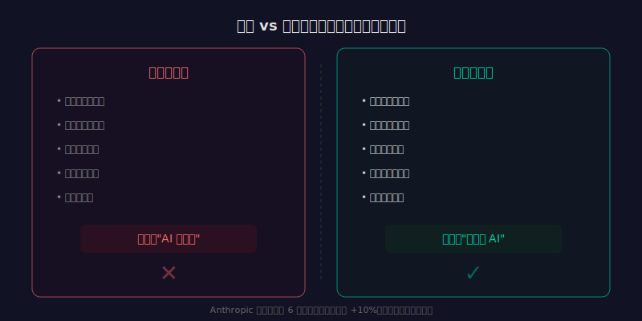

同一个团队，用同样的 AI 工具，有人觉得"太好用了离不开"，有人觉得"不过如此，还不如自己写"。

这个现象在很多公司都能看到。不是工具的问题，也不是智商的问题。是使用方式的问题。

Anthropic 在 2026 年 3 月发布的经济指数报告里有一个数据：使用 Claude 超过 6 个月的用户，任务完成率比新用户高 10%。https://www.anthropic.com/research/anthropic-economic-index

10% 看起来不大。但考虑到用的是同一个模型、同一个界面，这 10% 完全来自"使用方式"的差异。

我分析了一下，高效使用者和低效使用者之间，有 5 个关键差异。

---

## 差异一：任务拆解的粒度

低效使用者的典型操作：

"帮我写一个用户管理系统，包含注册、登录、权限管理、密码重置。"

然后对着 AI 的输出抱怨："不对，这不是我要的。"

高效使用者的做法：

先说："帮我设计用户管理系统的数据库表结构，需要支持邮箱注册和手机号注册。"

看完结果，再说："好，现在基于这个表结构，写注册接口的 API。输入参数是邮箱和密码，返回 JWT token。"

一步一步来。每步的范围小，AI 的理解准确，输出质量高。你的审查成本也低——看 30 行代码比看 300 行代码容易多了。

**核心区别：高效使用者不把 AI 当魔法棒，而是当一个需要明确指令的协作者。**

---

## 差异二：上下文管理

低效使用者在一个对话窗口里聊了 50 轮，讨论了 3 个不同的功能。到后面，AI 开始搞混之前的约定，输出越来越不稳定。

高效使用者会主动管理上下文：

- 不同任务开新对话
- 关键约定在每次对话开头重申
- 用结构化格式输入（而不是随意的自然语言）
- 重要的架构决策单独存一份，需要时粘贴给 AI

AI 的上下文窗口再大，也不是无限的。你塞的信息越多、越杂，AI 的注意力就越分散。**管理上下文，本质上是在管理 AI 的注意力。**

---

## 差异三：模型选择

低效使用者：不管什么任务，都用同一个模型。可能是公司统一提供的，可能是自己习惯用的。

高效使用者会按任务选模型：

- 快速代码补全 → Copilot 或轻量模型（Haiku、GPT-5-mini）
- 复杂推理和架构设计 → Opus 或 GPT-5.4
- 长文档分析 → Gemini（200 万 token 上下文）
- 中文内容 → Qwen 或 Claude（中文表现好）
- 批量处理 → 便宜模型（DeepSeek、开源模型）

这不是"炫技"，是经济学。用 Opus 做简单的格式转换，就像用法拉利送外卖——能送，但不划算。

**核心区别：高效使用者把 AI 当工具箱，不是万能钥匙。**

---

## 差异四：迭代方式

低效使用者期望 AI 一次就给出完美答案。AI 没给对，就换个 prompt 再试一次。试了三次还不行，就说"AI 不靠谱"。

高效使用者知道：好的结果几乎都是迭代出来的。

他们的工作流程是：

第一轮：给 AI 一个大方向，看它的理解对不对。
第二轮：纠正方向偏差，给更具体的约束。
第三轮：看具体实现，指出问题，让它修改。
第四轮：微调细节，确认最终结果。

4 轮对话拿到一个好结果，比 1 轮对话拿到一个差结果然后自己花 2 小时修改，效率高得多。

**核心区别：高效使用者把 AI 当需要 code review 的初级工程师，而不是应该一步到位的高级工程师。**

---

## 差异五：验证习惯

低效使用者：AI 生成了代码，直接复制粘贴，跑一下看看。不行再改。

高效使用者：AI 生成了代码，先读一遍，理解逻辑。然后跑测试。然后看边界情况。

区别在于：前者把 AI 的输出当"答案"，后者把 AI 的输出当"草稿"。

这不是多余的步骤。AI 生成的代码经常在"正常路径"上是对的，但在异常处理、边界条件、并发场景上有问题。不验证就用，迟早踩坑。

更关键的是：通过 review AI 的代码，你能学到它的思路，发现它的盲区，下次给它更好的指令。这是一个正反馈循环。

**核心区别：高效使用者对 AI 保持信任但验证（trust but verify），低效使用者要么盲信要么全盘否定。**

---

## 手感是练出来的

回到 Anthropic 报告里的那个数据：使用 6 个月后，任务完成率提高 10%。

这 10% 不是 AI 变强了，是人变强了。

具体来说，是人在以下方面变好了：

- 知道怎么拆解任务
- 知道怎么管理上下文
- 知道什么时候用什么模型
- 知道怎么迭代式地逼近好结果
- 知道怎么验证 AI 的输出

这些都不是"天赋"，是可以刻意练习的技能。

现在的情况很像 2010 年代的搜索引擎使用。有的人用 Google 能在 30 秒内找到任何信息，有的人搜了半天找不到。区别不在 Google，在于你会不会搜。

AI 是同样的道理。工具是一样的，手感决定了产出。

---

## 从今天开始

如果你觉得自己是"AI 没用"的那一边，试试这样做：

**第一，把下一个任务拆成 3 步以上再给 AI。** 不要一句话丢过去。

**第二，每次开新对话时，先用 2-3 句话说清楚背景和约束。** 不要假设 AI 知道你的上下文。

**第三，让 AI 先给方案，你来挑，再让它实现。** 不要直接要代码。

**第四，对 AI 的输出做一次 review，哪怕只是快速扫一遍。** 培养"草稿思维"而不是"答案思维"。

坚持两周，你会发现 AI 的"好用程度"明显提升。

不是它变了。是你变了。
